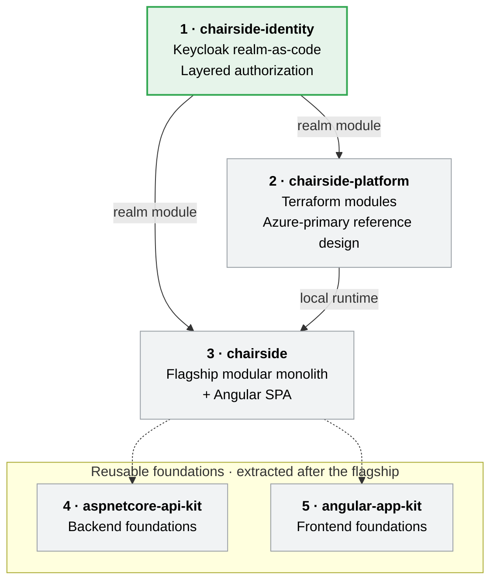

# Hi, I'm Norbert 👋

**Senior Software Engineer / Cloud Architect** — 15+ years building production systems, based in Seville, Spain.

I work across the full stack in **.NET** and **Angular**, and I care about the parts that are easy to get wrong: authorization boundaries, testing that targets real risk, infrastructure as code, and being honest about tradeoffs. I'm Microsoft Certified (**Azure Developer Associate, AZ-204**) and a **SAFe 5 Practitioner**.

🛠️ **Working with:** .NET · Angular · Keycloak · Terraform · Azure · PostgreSQL · Docker 
🔭 **Currently building:** `chairside-identity` — the security foundation of the portfolio below.

📫 [nsaid26@gmail.com](mailto:nsaid26@gmail.com) · [LinkedIn](https://www.linkedin.com/in/nsaid26/)

---

## The `chairside` portfolio

Most portfolios show *that* something works. These repositories are built to show *how I reason* — about boundaries, security, testing, infrastructure, and when a simpler solution would have been the right call.

The domain is **dental clinic management**, chosen deliberately: it forces authorization past simple role checks (a hygienist, a billing clerk, and a treating dentist see genuinely different slices of the same patient record). Everything uses **synthetic data** — it's a demonstration portfolio, not a product, and makes no compliance claims.

🟢 in progress · ⚪ planned · dashed edges = extracted from the flagship once it exists

**Build order is deliberate.** Identity comes first because it was the highest-risk unknown and two other repositories depend on its realm module — better to learn it in a small repo than inside the flagship. The reusable kits are extracted *after* the flagship exists, so the extraction is evidence-driven rather than speculative.

### The repositories

| # | Repository | What it demonstrates | Status |
| --- | --- | --- | --- |
| 1 | **chairside-identity** | Complete OIDC flow as the subject, not a detail: Keycloak realm-as-code, three-layer authorization, tests weighted toward denial | 🚧 In progress *(private)* |
| 2 | **chairside-platform** | Reusable Terraform modules; `local` genuinely provisioned, `qa`/`prod` designed and documented; Azure-primary reference design | 🗓️ Planned |
| 3 | **chairside** | Flagship modular monolith API + Angular SPA — `Scheduling`, `Patients`, `Clinical`, `Billing` as vertical slices | 🗓️ Planned |
| 4 | **aspnetcore-api-kit** | Backend foundations, extracted from the flagship once two consumers justify it | 🗓️ Planned |
| 5 | **angular-app-kit** | Frontend foundations, extracted on the same evidence-driven basis | 🗓️ Planned |

> Links will appear here as each repository is made public.

---

*15+ years across Magaya, Solera, Globant, Infocorp and Urudata — from feature delivery to cloud architecture and team leadership.*
